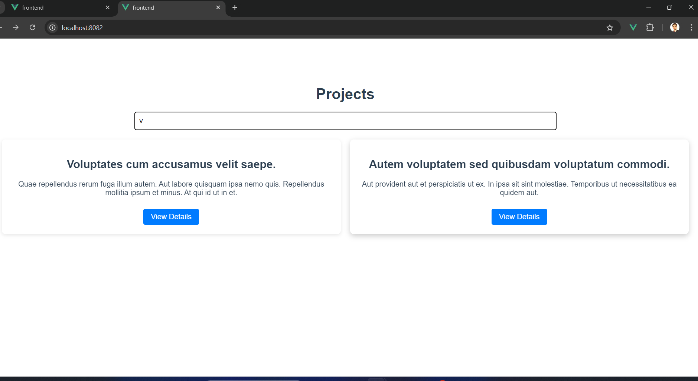
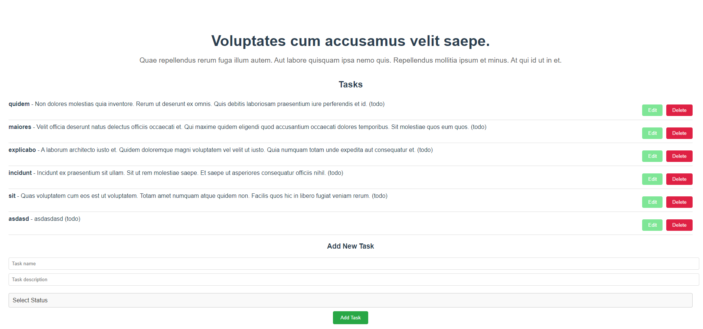

**Run front and backend application with below commands**

`cd backend`

`cp .env.example .env`

`docker-compose up --build `

`docker-compose run --rm composer update`

`docker-compose run --rm artisan migrate:fresh --seed`

**Persistent MySQL Storage**

_Create a mysql folder in the project root, alongside the backend and frontend folders._

###### uncomment volumes in mysql in backend/docker-compose.yml file

**Want to see nginx logs**

_Create a logs/server folder in the project root, alongside the backend and frontend folders._

###### uncomment volumes in webservice in backend/docker-compose.yml file

